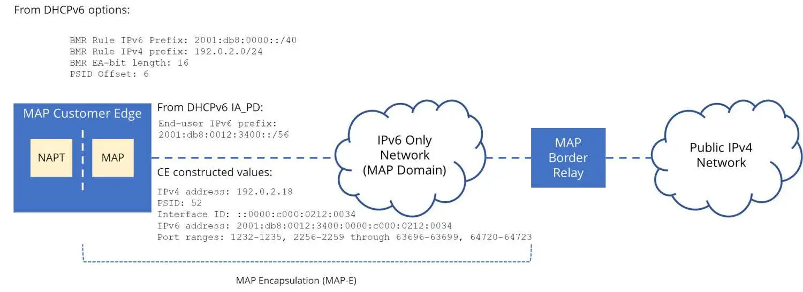

# OpenBSD MAP-E CE

This repository contains a collection of scripts and guides to enable MAP-E support to [OpenBSD](https://www.openbsd.org/).
MAP-E, described in detailed in [RFC7597](https://datatracker.ietf.org/doc/html/rfc7597), is a common technology used by ISPs adopting IPv6. The protocol encapsulates IPv4 traffic into IPv6.



## What works right now?

A [packet filter patch](https://github.com/toru-mano/openbsd-pf-map-e-ce) has been made publicly available since 2021. Applying the patch allows enables the port-mapping. Once the system's packet filter has been patched, use the perl scripts to bring up a `gif0` interface.

## Howto

Install the non-metrics scripts:

```sh
doas make install
```

`mape-derive` prefers live OpenBSD 7.8 `dhcp6leased` MAP-E values from
`/var/db/dhcp6leased/$LEASE_IF`: `ia_pd`, `mape_br`, `mape_rule`, and
`mape_portparams`. If the lease file is not readable it falls back to
`dhcp6leasectl -l "$LEASE_IF"`. Values not supplied by DHCP, such as
`WAN_IF`, `GIF_IF`, `LAN_NET`, `GIF_MTU`, and `PF_ANCHOR_FILE`, still come from
`/etc/mape.conf`.

Bring MAP-E up manually:

```sh
doas /usr/local/sbin/mape-up
```

To re-apply MAP-E automatically when the DHCP MAP-E values change, run the
watcher as a daemon:

```sh
doas /usr/local/sbin/mape-watch -d
```

On OpenBSD, `mape-watch` uses `kqueue(2)` through the optional `IO::KQueue`
Perl module when it can watch `LEASE_FILE`. Without that module, or when the
lease file is unavailable and only `dhcp6leasectl` can be queried, it falls back
to polling every 30 seconds. Force polling with `-p`, or change the interval
with `-i seconds`.

Enable the daemon at boot:

```sh
doas rcctl enable mape_watch
doas rcctl start mape_watch
```

The watcher logs to syslog with `info`, `warn`, and `debug` levels. Set
`MAPE_LOG_LEVEL="debug"` in `/etc/mape.conf` while troubleshooting, or pass
`-l debug` when running it by hand.

For debugging, keep it in the foreground:

```sh
doas /usr/local/sbin/mape-watch -f
```

For cron-style polling instead of a persistent process:

```sh
* * * * * /usr/local/sbin/mape-watch -1
```
